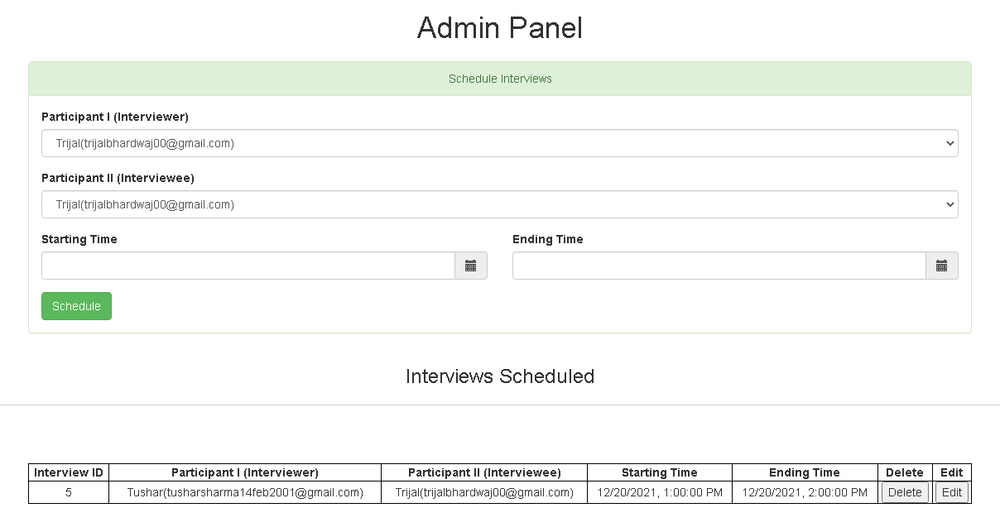
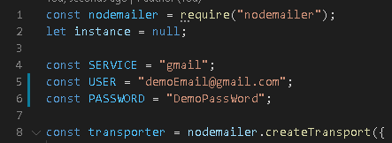

# Scaler Interview-Creation-Portal

This is a Single Page Simple App For Interview Creation Portal where admins can create interviews by selecting participants, interview start time and end time.



## Basic Functionalities

1. An interview creation page where the admin can create an interview by selecting participants, start time and end time. Backend should throw error with proper error message if: 

  * Any of the participants is not available during the scheduled time (i.e, has another interview scheduled)
  * No of participants is less than 2

2. An interviews list page where admin can see all the upcoming interviews.

3. An interview edit page where admin can edit the created interview with the same validations as on the creation page.

## Extra Functionalities

4. Send emails to participants on interview creation, updation and deletion.

5. App’s frontend as a SPA


## Requirements/Tech Stack

* NodeJS
* MySQL Server On Local Machine

## Setup and Instructions

#### 1. Clone the Repository

On the terminal run the following commands

```sh

$ git clone https://github.com/trijal-bhardwaj/Scaler-Interview_Creation_Portal.git

$ cd server

$ npm install (To Install All Dependencies)

```
#### 2. Setup MySQL Database

* Create a DataBase & Name it as **InterviewBit**
* Create Two Tables in this DataBase 

    1.  **users** (Contains Data of Users) 
    2.  **interviews** (Contains Data of Scheduled Interviews)

* Insert Some Data in users Table. 
* Inserting Data in **interviews** Table is NOT Required. It will get Added Itself when a New Interview will be Scheduled.


### Sample SQL Queries


#### 3. Run the Server

```sh
cd BackEnd
nodemon app
```

This will Start the Server. Now, Go to **/FrontEnd-SPA** Folder & Open **index.html**.


## Starting the E-Mail Sending Services

NodeMailer is Used to Send the E-Mails For Schedules/Updated/Cancelled Interviews. Change the USER and PASSWORD and Set It to the Credentials of the E-Mail from Which You Want to Send Out the E-Mails.




### Sample E-Mail 


